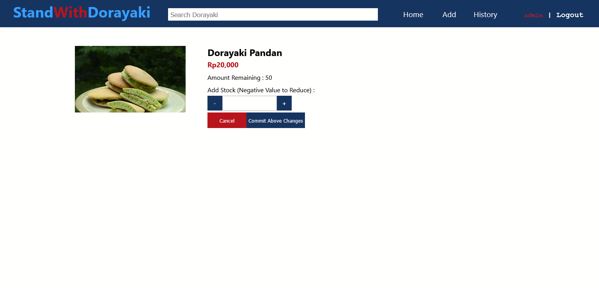

# Tugas Besar I IF3110 WBD 2021 Kelompok 41 - GiantSun
> Monolithic Web App - Dorayaki Store

## Table of contents
  - [Deskripsi Aplikasi Web](#deskripsi-aplikasi-web)
  - [Requirements](#requirements)
  - [Cara Instalasi](#cara-instalasi)
  - [Cara Menjalankan Server](#cara-menjalankan-server)
  - [Screenshots](#screenshots)
  - [Pembagian Tugas](#pembagian-tugas)

## Deskripsi Aplikasi Web
Aplikasi Web Monolitik berbasiskan PHP, JavaScript, AJAX, dan dilengkapi basis data menggunakan SQLite. Aplikasi Web mensimulasikan online shop dorayaki sederhana yang menitikberatkan pada manajemen stok item-item dorayaki.
Fitur-fitur yang tersedia meliputi :
- Autentikasi Pengguna
- Pengelolaan Varian Dorayaki
- Manajemen Stok Dorayaki
- Melihat Daftar Varian Dorayaki
- Melihat Riwayat Perubahan Stok Dorayaki
- Pembelian Dorayaki
- Melihat Riwayat Pembelian Dorayaki

## Requirements
1. [XAMPP](https://www.apachefriends.org/download.html) , dilengkapi PHP dan SQLite
2. Web Browser (disarankan versi terbaru, support HTML 5, CSS 3, dan JavaScript ES6)

## Cara Instalasi
0. Download dan Install [XAMPP](https://www.apachefriends.org/download.html)
1. Pastikan PHP sudah berada pada Path pada Environment Variable : masukkan path direktori yang mengandung `php.exe` pada Path Environment Variable
2. Pastikan SQLite sudah di config pada `php.ini` yang dapat diakses pada bagian Config pada antarmuka XAMPP Module Apache , un-comment `extension=pdo_sqlite` dan `extension=sqlite3`
3. Download repositori ini (tugas-besar-1), taruh di dalam direktori instalasi XAMPP pada `xampp/htdocs`

## Cara Menjalankan Server
0. Run XAMPP, start module Apache dan MySQL
1. Run command line, change directory ke direktori tempat aplikasi web berada `xampp/htdocs/tugas-besar-1`, run command `php -S localhost:port-number`, jika port number yang digunakan adalah 8080 maka command yang digunakan `php -S localhost:8080`
2.  Untuk inisialisasi basis data pada pertama kalinya, pergi ke URL `localhost:8080/db/init_db.php` dan `localhost:8080/db/init_sample.php` pada browser (untuk inisialisasi sampel data); Asumsi port yang digunakan = 8080
3.  Jika data sudah diinisialisasi, dapat mengakses aplikasi web dengan pergi ke URL `localhost:8080` pada browser (basis data tidak perlu diinisialisasi ulang untuk penggunaan berikutnya).
4.  Akan ditampilkan halaman index, jika belum login maka diarahkan ke halaman login.
  
## Screenshots (selengkapnya pada direktori screenshots)
- Login 
- Sign Up 
- Dashboard 
- Dorayaki Details 
- Change Amount 
- Add Variant 
- Edit Variant 
- Transaction History 
- Product Specific History 
- Search Result 
- Perubahan Tubes2 : dashboard admin 

## Perubahan Pada Tugas Besar 2
- Menghilangkan Halaman Add Dorayaki -> Menggantinya dengan halaman Update, berguna untuk melakukan     
  fetch terhadap data nama dorayaki melalui protokol SOAP pada Java Servlet
- Pada halaman edit dorayaki untuk setiap dorayaki tidak dapat melakukan perubahan nama dan stok  
  dorayaki, hanya dapat mengedit harga, deskripsi, dan gambar
- Untuk menambah dan mengurangi stok dorayaki pada halaman edit_amount dilakukan request perubahan stok 
  lewat protokol SOAP pada Java Servlet (submitChangeSOAP pada util/item_util.php) 
- Menambahkan halaman yang isinya pending request perubahan stok dorayaki

## Pembagian Tugas
### Server-side
- Login : 13519091
- Register : 13519091
- Dashboard : 13519069
- Hasil pencarian : 13519069
- Penambahan,pengubahan,penghapusan varian dorayaki : 13519018
- Detail varian dorayaki : 13519018
- Pengubahan stok/Pembelian dorayaki : 13519018
- Data Expire Time : 13519091
- Docker : -
- Halaman Riwayat Pengubahan stok/Pembelian dorayaki : 13519018
- Halaman Update : 13519018 

### Client-side
- Login : 13519091
- Register : 13519091
- Dashboard : 13519069, 13519018
- Hasil pencarian : 13519069
- Penambahan,pengubahan,penghapusan varian dorayaki : 13519018
- Detail varian dorayaki : 13519018
- Pengubahan stok/Pembelian dorayaki : 13519018
- Responsive design : 13519018, 13519069, 13519091
- Halaman Riwayat Pengubahan stok/Pembelian dorayaki : 13519018
- Halaman Update : 13519018 
